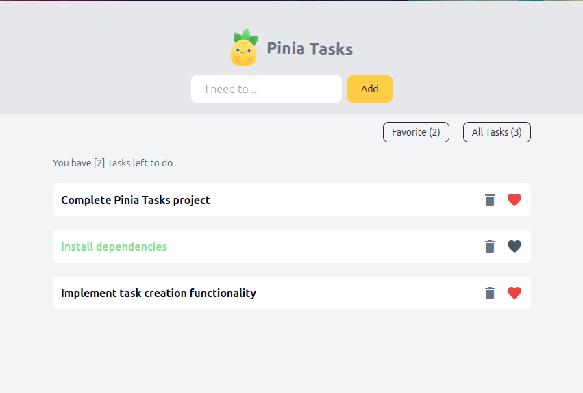

# Pinia Tasks

Pinia Tasks is a project based on Pinia state management, json-server and Vue.js.

## Project Overview


## Recommended IDE Setup

For optimal development experience, we recommend using:

- [VSCode](https://code.visualstudio.com/)
- [Volar](https://marketplace.visualstudio.com/items?itemName=Vue.volar) extension for Vue 3 (Disable Vetur if enabled)

## Customize Configuration

For custom configuration options, refer to the [Vite Configuration Reference](https://vitejs.dev/config/).

## Project Setup

```sh
npm install
```

### Compile and Hot-Reload for Development

```sh
npm run dev
```

### Compile and Minify for Production

```sh
npm run build
```

### Lint with [ESLint](https://eslint.org/)

```sh
npm run lint
```
